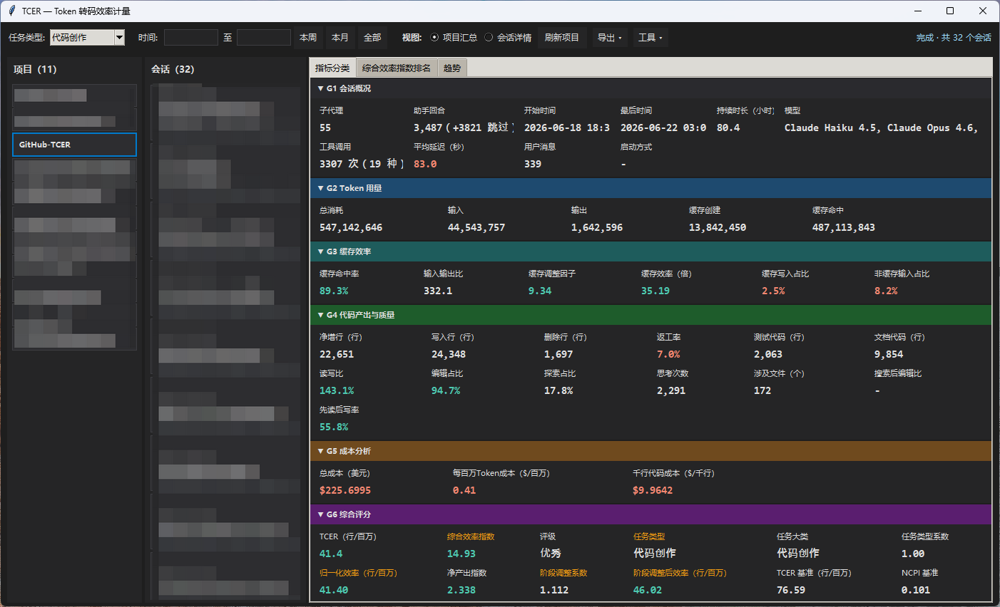
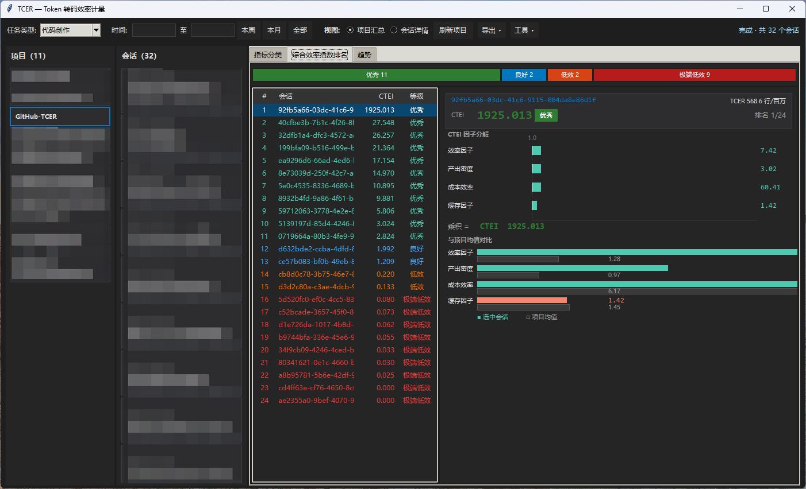
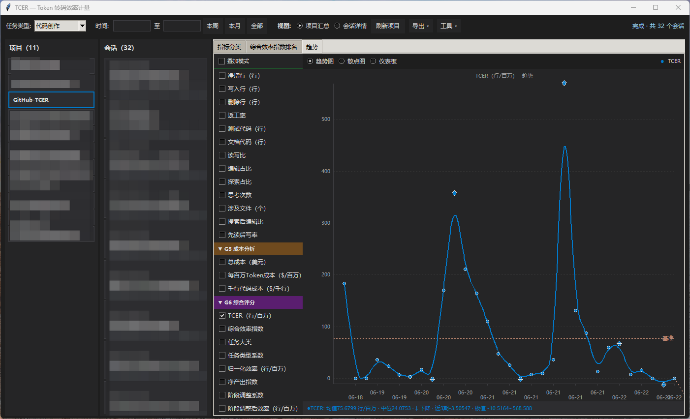
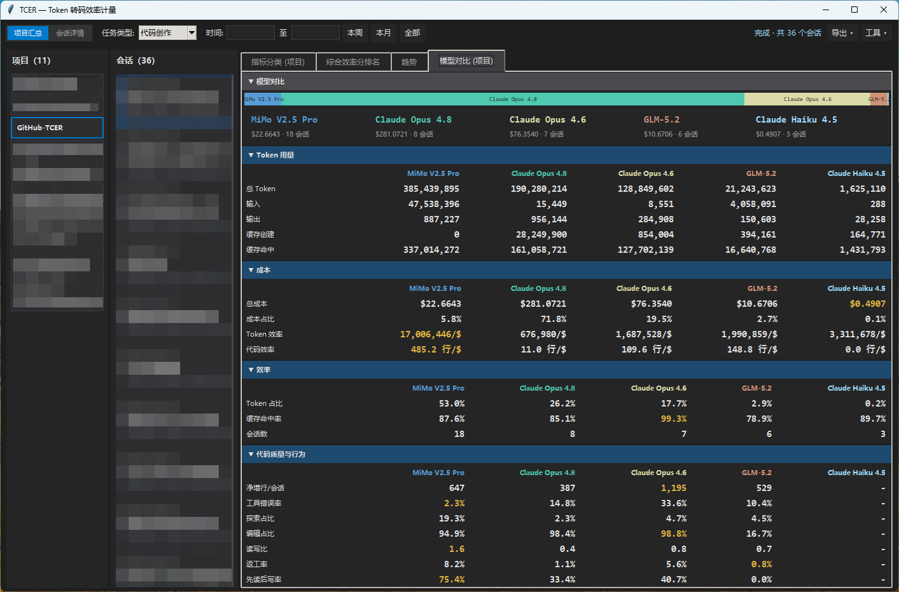
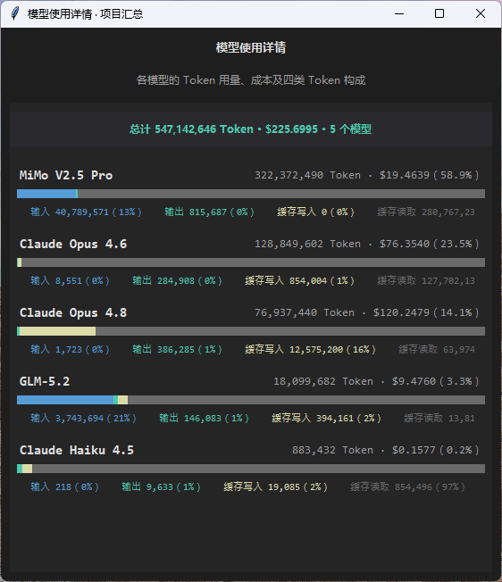
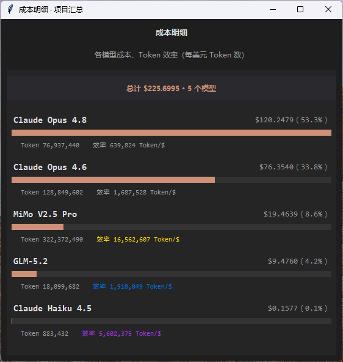
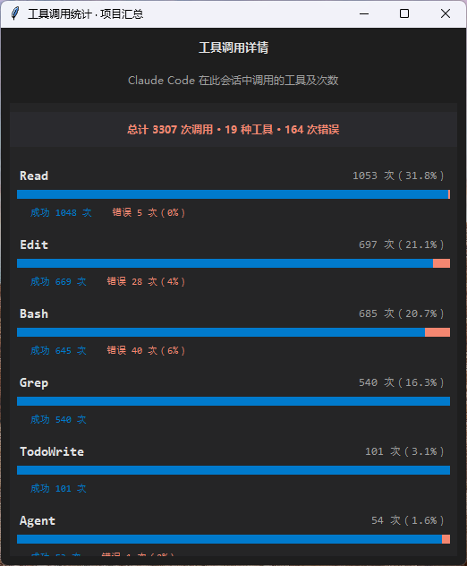
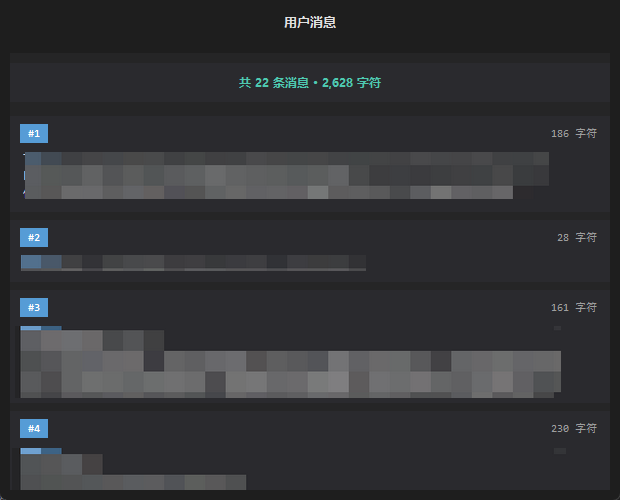
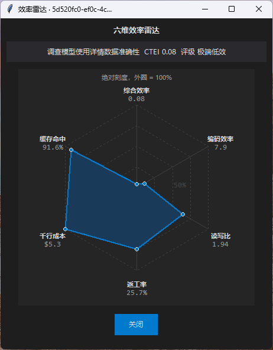

# TCER

> **Token-to-Code Efficiency Ratio** — 度量 AI 编程效率的离线分析工具

基于 Claude Code（`~/.claude/`）、Codex（`~/.codex/`）与 OpenCode（`~/.local/share/opencode/`）本地会话数据，多维度量化「每消耗多少 Token、产出多少有效代码」。



## 快速开始

**推荐方式**：双击启动脚本（自动检测 Python 环境）

- Windows：`launch.bat`
- macOS：`launch.command`

**命令行**：

```bash
python -m tcer
```

Tkinter 桌面界面，纯离线运行。需要 Python ≥3.11 标准库，零依赖，免安装。

**闭环审计**（对照本地真实会话文件重算，改 core 后建议跑）：

```bash
python -m tcer.audit --list
python -m tcer.audit --source claude --project TCER --top 5
python -m tcer.audit --all-projects --top 1 --no-loc   # 批跑全部本地项目
# CI 推荐（一行结果 + 摘要 JSON，退出码 0/1）：
python -m tcer.audit --all-projects --skip-empty --top 1 --no-loc -q --summary-json audit-summary.json
```

默认在统一项目列表中展示 Claude / Codex / OpenCode 项目，可通过顶部「来源」切换。Codex 与 OpenCode 均为只读分析：Codex 读取本地 JSONL，OpenCode 读取官方本地 SQLite（兼容旧 storage JSON 发现）；支持会话、Token、成本、模型、工具行为、趋势、运行环境、推理输出、图片输入等信号。Codex 仅在会话包含可解析 `apply_patch` 记录时计算 LOC/TCER；OpenCode 优先使用 session summary 中的 diff 统计。

## 特性

**70+ 项指标，6 组分类**：会话概况、Token 用量、缓存效率、代码产出与质量、成本分析、综合评分。鼠标悬停即有中文解释。


**综合效率指数排名**：多维合成评分，一眼看出哪个项目效率最高。



**趋势分析**：按时间维度追踪效率变化，支持按周/月筛选。



**模型对比**：多模型并排横评，按成本分布条排序，覆盖 Token 用量、成本、效率、代码质量与行为四大维度，一眼看清各模型的性价比与产出特征。



**逐模型详情**：四色堆叠条展示每种模型的 Token 构成（输入/输出/缓存写入/缓存读取），支持 ≈162 模型定价。



**成本明细**：按模型成本降序排列，显示 Token 效率（每美元 Token 数），前三名金银铜配色。



**工具调用统计**：成功/错误双色堆叠条，一目了然。



**用户消息**：卡片式布局，快速回顾会话内容。



**六维效率雷达**：综合效率、缓存命中、千行成本、返工率、读写比、编码效率六维可视化。



## 文档

- [指标公式与计算步骤](doc/metrics.md)
- [JSONL 数据格式](doc/data-format.md)
- [架构与工程规范](doc/architecture.md)
- [项目规格](CLAUDE.md)

## 许可

MIT
