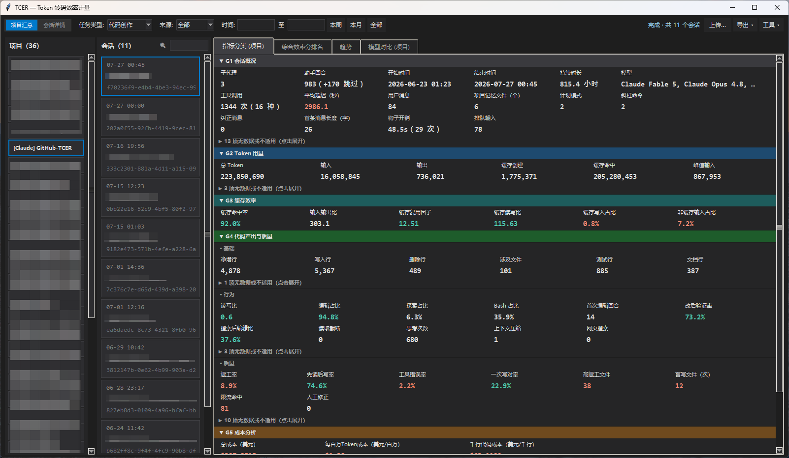
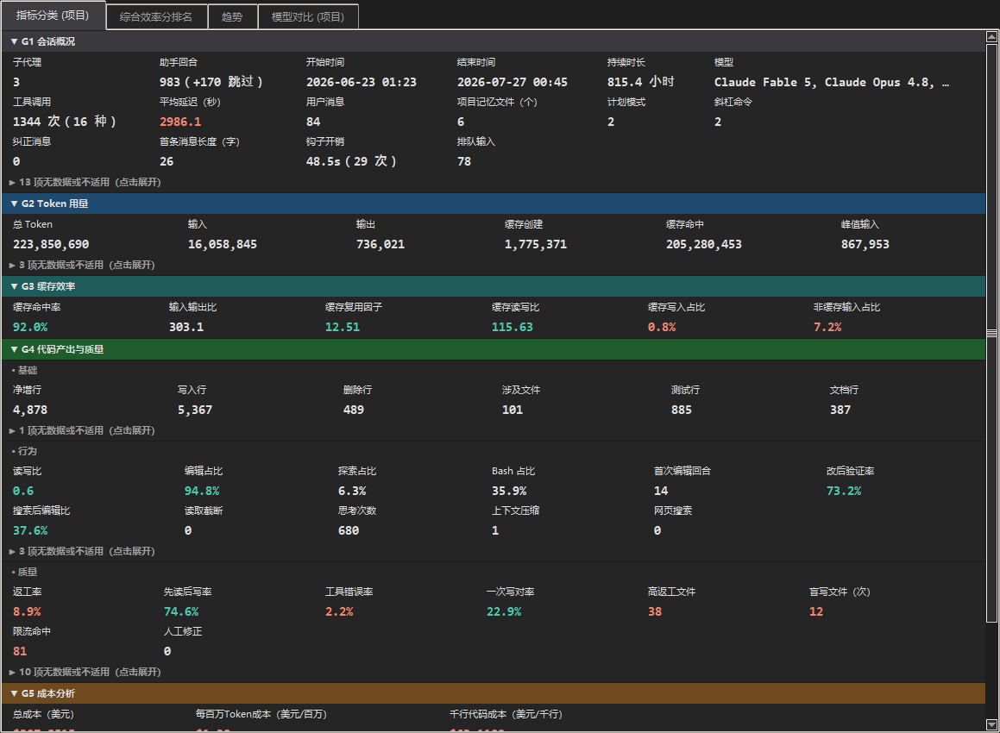
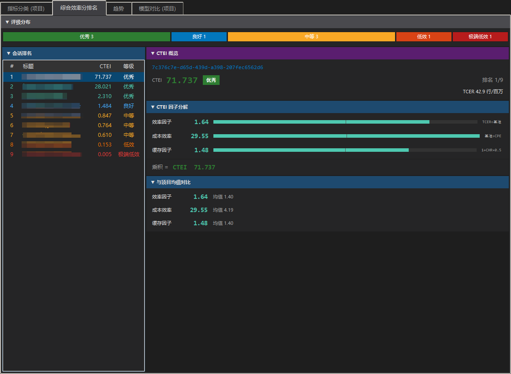
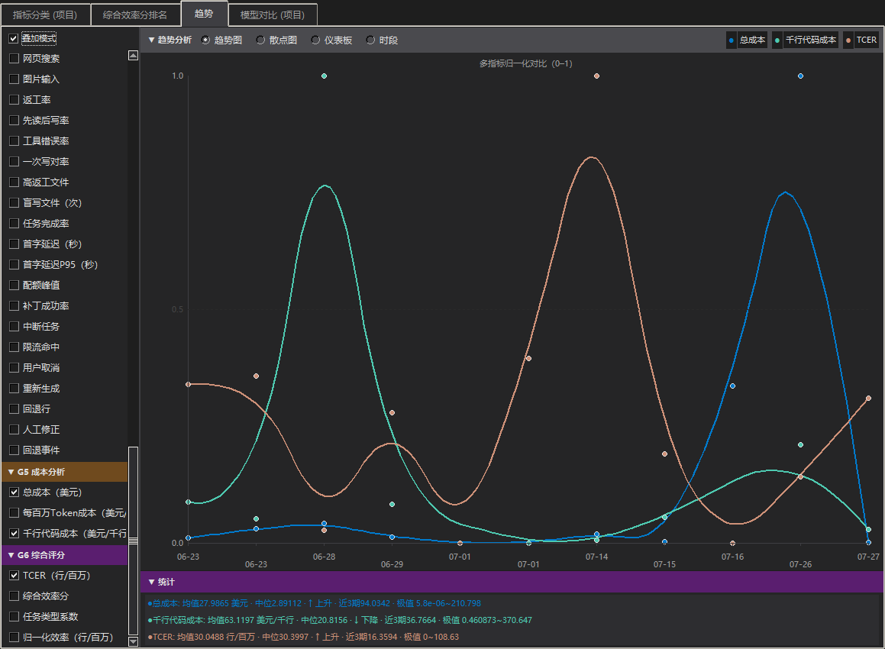
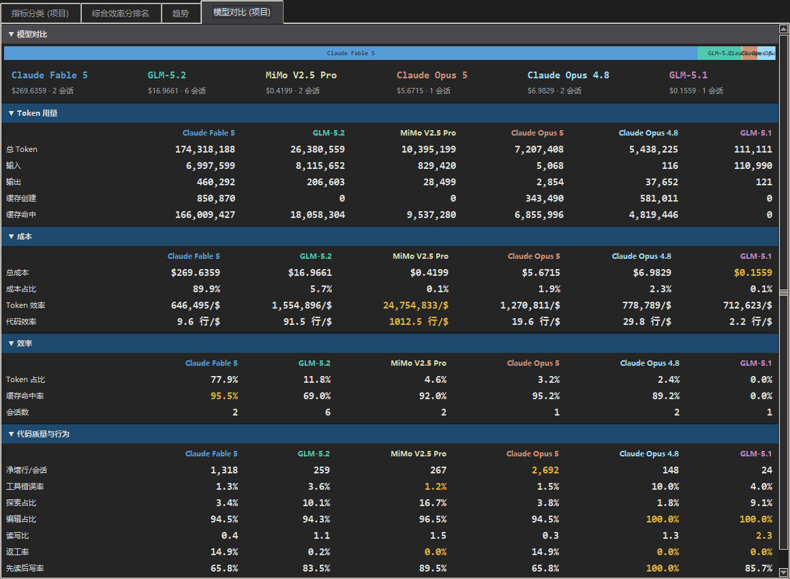
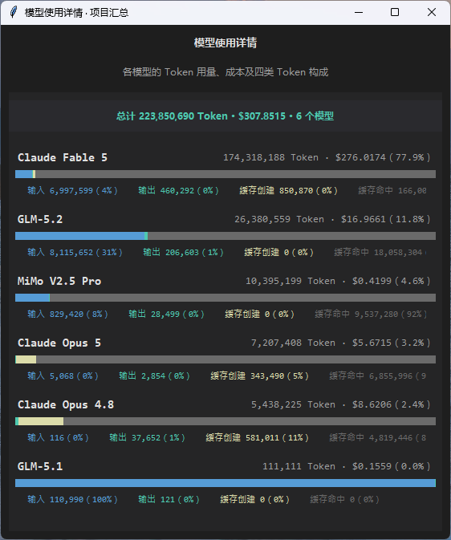
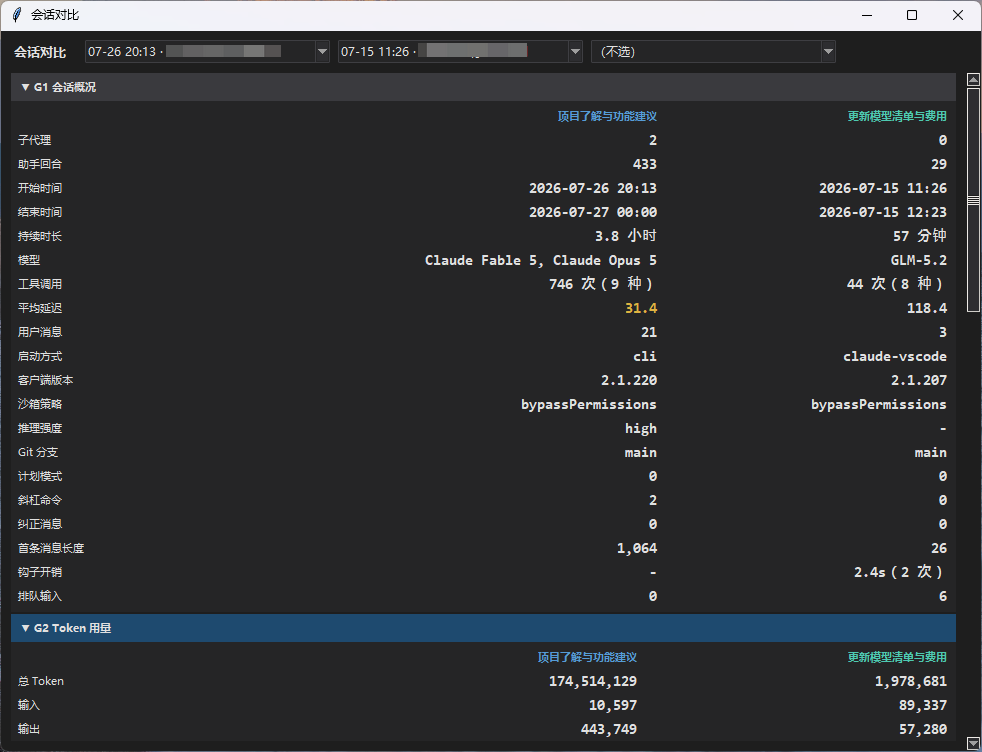

<p align="center">
  
</p>

# TCER

> **Token-to-Code Efficiency Ratio** — 度量 AI 编程效率的离线分析工具

基于 Claude Code、Codex、OpenCode、Grok 与 Oh My Pi（omp）本地会话数据，多维度量化「每消耗多少 Token、产出多少有效代码」。

Tkinter 桌面界面，纯离线运行。需要 Python ≥3.11 标准库，零依赖，免安装。



## 快速开始

**方式一：下载预编译版**（无需安装 Python）

从 [Releases](https://github.com/yqlizeao/TCER/releases) 下载对应平台文件，双击即可运行。

- **Windows**：`TCER-windows-x64.exe`，双击运行。
- **macOS（M 芯片）**：`TCER-macos-arm64`。因未做代码签名，首次打开会被 Gatekeeper 拦截，任选其一解除：
  - Finder 中**右键 → 打开**（确认对话框再点「打开」）；或
  - 终端执行 `xattr -dr com.apple.quarantine /路径/TCER-macos-arm64`，随后 `chmod +x` 运行。

启动时默认自动检查新版本（联网仅查公开 Release，不发送任何用户数据）；可在「工具」菜单点「检查更新…」手动检查或关闭自动检查。

**方式二：已装 Python / 开发者**

- Windows：`launch.bat`
- macOS：`launch.command`
- 命令行：

```bash
python -m tcer
```


## 特性

**近百项指标，6 组分类**：鼠标悬停即有中文解释。



**综合效率指数排名**：多维合成评分，一眼看出哪次会话效率最高。



**趋势分析**：按时间维度追踪效率变化。



**模型对比**：多模型并排横评，一眼看清各模型的性价比与产出特征。



**逐模型详情**：四色堆叠条展示每种模型的 Token 构成。



**会话对比**：选 2~3 个会话并排对比全部指标，标注每行最优值。


**HTML 报告导出**：导出菜单支持项目级 / 会话级自包含单文件 HTML 报告（深色主题、可排序会话表、CTEI 排名条、模型对比表），零依赖、可直接分享；另有 Markdown / JSON / CSV。

## 文档

- [指标公式与计算步骤](doc/metrics.md)
- [JSONL 数据格式](doc/data-format.md)
- [架构与工程规范](doc/architecture.md)
- [项目规格](CLAUDE.md)

## 许可

MIT
